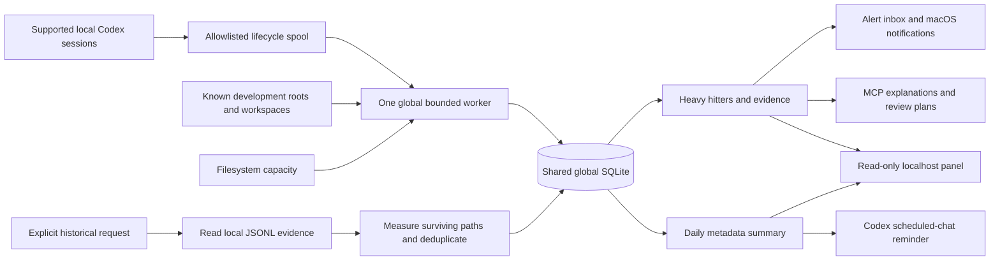

# Architecture — 0.3.1

An independent local Codex-specific development storage growth monitor. [Product scope](product-scope.md) defines global monitoring/alerts and explicit pre-enable historical occupancy analysis. Personal use takes priority; no deletion, telemetry or remote service exists.

## Boundaries

- `config.py`: stable machine paths, legacy validation and version-2 routing. `monitor.normalize` validates new configuration; global state ignores version-specific `PLUGIN_DATA`.
- `service.py`: transport-independent dispatch and minimal lifecycle metadata. Version-2 hooks enqueue events and ensure a worker; they do no directory scan. Observer MCP calls are excluded to avoid feedback.
- `monitor.py`: global enable/disable, discovery, elected worker, root scheduling, capacity samples, complete-baseline comparisons, alert deduplication and delivery.
- `inventory.py`: resumable, descriptor-relative metadata walks with no-follow child opens, device/depth boundaries, bounded hardlink set and top files. No ordinary artifact contents are opened.
- `global_store.py`: separate schema-versioned `global.sqlite3`; read-only queries do not initialize absent state. Serial worker writes; explicit history/ack writes use SQLite locking/transactions.
- `historical.py`: explicitly requested current/archived local JSONL adapter, structured surviving path evidence, bounded metadata measurement and global inode deduplication. Derived references/measurements persist, raw transcript text does not.
- `mcp.py`/`cli.py`: nine local stdio tools and direct operations with bounded input validation.
- `panel.py`: fixed-route loopback read-only HTTP snapshot; Host/Origin validation, CSP and no external resources.
- `summaries.py`: durable 90-day daily endpoints/reports; no artifact/session traversal.
- `supervisor.py`: explicitly installed macOS user LaunchAgent, stable runtime pointer and failure restart; successful disabled exit stays stopped.
- `observer.py`, `store.py`, `engine.py`: preserved version-1 explicit-root snapshot engine, same-scope task/turn baselines and directory buckets. Existing `footprint.sqlite3` is not rewritten.
- `packaging.py`: reproducible full local ZIP, including hooks, MCP, source, docs and tests.

## Lifecycle and worker

Seven lifecycle events receive SessionStart, UserPromptSubmit, PreToolUse, PostToolUse, Stop, SessionEnd and Interrupt. They store allowlisted IDs, tool/family labels, workspace and timestamp, never prompt, command, arguments, raw output or environment. Invalid input/config remains fail-open with a diagnostic and exit 0. Short Interrupt hooks may still be terminated by the host; acceptance must expose gaps.

Atomic spool files allow concurrent clients. A held filesystem lock elects exactly one worker; race losers exit. Each tick drains bounded events, discovers/compacts roots and advances fair bounded walks. Unused entry budget is redistributed across active walks while the time slice remains; recent lifecycle work prioritizes its root as capacity becomes available, preserving in-progress cold cursors. Open walks remain bounded. Volume sampling is independent of directory completion. Open traversals are capped according to descriptor limits. Worker health is checked using the held lock and a heartbeat, not PID alone.

Disable sets global `enabled=false`; the worker exits at its next tick. The WXY plugin's global host `enabled=false` is also observed. No history is erased. An explicitly installed macOS user service starts at login and restarts failures. Without installation, crash recovery waits for the next trusted event/explicit enable/scan. The service honors both global and host disable switches. Partially completed traversal state is in memory; after a crash it restarts with incomplete coverage rather than pretending completion. Explicit scan writes a real refresh request and can start a worker even when automatic startup is off.

## Measurements and signals

Complete root endpoints with the same canonical path, exclusions, state exclusion and accounting version permit allocated-byte differences. Exclusion changes close current walks and establish new baselines. Incomplete endpoints/first discoveries retain unknown growth. Root inventory is live and not atomic. Hardlinks deduplicate within each monitor root; root totals are not summed across roots. APFS shared extents and filesystem overhead are not modeled.

Signals cover substantial growth, average growth rate, new file counts, crossing large-occupancy thresholds, consecutive sustained complete growth, and low available filesystem capacity. Disk pressure is explicitly unattributed. Alerts persist path/window/coverage/session associations, recommendation, acknowledgement and delivery status. Fingerprint/cooldown/material-change checks keep unchanged conditions quiet. Session associations use recent lifecycle/workspace evidence; they do not isolate writers or produce unique additive session totals. Global turn filtering is unsupported and reports unknown attribution.

macOS delivery uses native `display notification`; a successful command is recorded as accepted with visibility unverified. OS settings can suppress banners. An inbox remains queryable. A separate acceptance probe never creates a production growth finding. Linux currently has inbox support only.

## Explicit historical investigation

Only `footprint_analyze_history`/`analyze-history` reads historical records. Supported JSONL records are `session_meta`, `turn_context`, and structured `function_call_output`/`custom_tool_call_output`. Workspace context gives a candidate association; checked output path references give recorded association. Neither proves creation, inactivity or exclusive ownership. Planned commands/messages are not creation evidence.

The adapter reads current and archived session directories read-only, bounds source files/records/line size/time and artifact entries, records source-file/line references, then measures surviving paths. Recorded references are measured first; candidates cannot inflate the recorded subtotal. Parent/child/shared paths and hardlinks share one inode set. Missing paths contribute no present bytes. Unclassified volume capacity is not invented as artifact bytes. Historical growth is unknown without usable historical measurement endpoints.

Current history analysis is synchronous and bounded to at most ten seconds. A partial result is a lower bound; another request starts again rather than resuming a durable job. Only declared formats are supported. Additional evidence adapters, durable historical jobs, process lineage, transient peaks and Docker guest internals are future work.

## Retention and privacy

Default global retention is 500 finished observations, volume samples, findings and analysis results each, plus 5,000 events. Latest inventory persists separately. Many roots or small retention can evict comparable baselines, yielding unknown growth. SQLite reuses freed pages; no automatic vacuum or user-artifact deletion occurs. Global data stays outside projects/plugin versions. A legacy configuration is backed up before upgrading; its original database remains queryable through that saved configuration.

## Derived daily reports and UI

Complete monitor endpoints update daily first/last rows before snapshot pruning. Rollups are idempotent by local date and retained 90 days; they disclose independent observation intervals and never imply full-day coverage from short samples. Missing endpoints or changed scope yield unknown growth. Roots and session figures are not summed. Preparing a rollup and refreshing a panel read retained metadata only.

The worker owns a read-only loopback server. A standalone panel server is also available, with no scan side effect. A separate Codex scheduled chat calls the daily operation at 21:00 and reports through supported app activity. Immediate third-party notification-center push has no established public API; system notifications and the durable inbox remain the immediate channel. See official [notifications](https://learn.chatgpt.com/docs/notifications), [scheduled tasks](https://learn.chatgpt.com/docs/automations?surface=app) and the [delivery plan](monitor-dashboard-plan.md).

The hook shell checks that the cached entrypoint exists and tolerates Python startup failure; it never makes an authorization decision. `scripts/update_plugin.py` preserves prior chat entrypoints across the supported CLI upgrade and moves an existing stable runtime pointer. Installer failure restores the preceding runtime when available. Ordinary metadata scanning uses `scandir`/`stat` and capacity uses `statvfs`; no StorageManagement API is called. A 20-ms traversal slice excludes scheduling, SQLite and filesystem latency, so it is not a total CPU guarantee.
