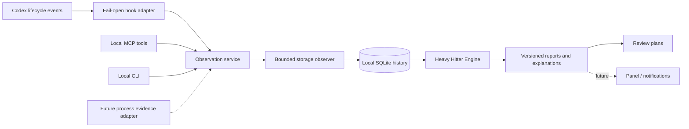

# Architecture — V1

Codex Footprint is a Codex-specific development storage growth monitor. The first implementation is local, metadata-only and non-destructive. Current scope is personal local use; the complete lifecycle/MCP flow takes priority over public distribution.

## Source boundaries

- `config.py`: opt-in roots, strict schema, scan budgets, root-overlap rejection, scope identity and retention validation.
- `observer.py`: local directory metadata traversal. Tracks allocated and logical bytes, entry/unique file counts, non-overlapping directory buckets, hardlink duplicates, top files and incomplete coverage. No regular file content is opened.
- `store.py`: schema-versioned SQLite events and snapshots, a serialized capture transaction, rollback journaling and bounded retention.
- `engine.py`: first/retained/task baselines, heavy hitters, tool windows, explanations and non-executing review plans. Snapshot maps are prepared once per report; analysis scales with retained bucket observations rather than repeatedly scanning the filesystem.
- `service.py`: shared transport-independent operations and hook metadata normalization. The root set comes only from explicit configuration. Read queries use a read-only database connection; they never initialize an empty history.
- `mcp.py`: local stdio MCP adapter with five tools, JSON-RPC initialization, strict tool arguments and bounded input messages. No network listener, filesystem mutation tool or UI capability.
- `cli.py`: local entrypoint and fail-open hook boundary. Packaged scripts resolve source paths from their own location.
- `packaging.py`: allowlisted reproducible local package construction, including complete lifecycle hooks, MCP wiring and documentation.

## Event contract and ordering

SessionStart establishes a session observation. UserPromptSubmit establishes a turn observation. PreToolUse/PostToolUse bracket tools using session ID + turn ID + tool-call ID. Stop captures the last turn observation. SessionEnd and Interrupt record metadata only, avoiding a traversal under the short interrupt budget.

Hooks remain synchronous so a pre-snapshot finishes before the tool begins. Each observation has a shared time/entry budget across all roots; SQLite `BEGIN IMMEDIATE` serializes captures so competing hook processes cannot commit stale scans out of order. Rollback journaling allows system-Python read-only SQLite connections to reopen a closed history without initializing WAL sidecars. Readers see committed history; captures serialize, and a busy/locked database is a visible fail-open observation gap. Other processes may write during traversal; this is not an atomic filesystem snapshot. A busy database, invalid configuration, malformed input, permission denial or scan exception leaves a stderr diagnostic and exit 0, with no stdout or Codex decision fields. Timeout/kill safety relies on the host continuing after a failed observer hook; real-host validation is still required.

The adapter stores only allowlisted event fields. Executable-family hints are labels inferred from the first command token, not process evidence. No command arguments, prompt text, transcript, tool output, PID ownership or environment values are stored. Calls to the observer's own MCP tools are ignored by the hook adapter to avoid feedback loops.

## Measurement and attribution

Directory buckets form a partition: root-level files use the root bucket, deeper files use up to `bucket_depth` directory segments. Root totals and bucket totals must not be added together. Hardlink inode identities are deduplicated across roots in configured order; file-entry counts still include hardlink names. APFS clones/shared extents and filesystem metadata are outside this accounting model.

A scope hash includes canonical roots, observer settings, exclusions, data directory and accounting version. Configuration scope changes cannot silently subtract incomparable snapshots. Threshold and retention changes do not change measured scope. Default reports compare the first and latest retained observations in that scope. Task reports require their own SessionStart or UserPromptSubmit baseline; a retained PostToolUse cannot fabricate a missing pre-baseline.

A comparison requires complete endpoints. Partial snapshots display lower-bound observed occupancy and diagnostics; numeric growth and rates remain unknown. Sustained growth requires multiple positive complete intervals; unchanged observations neither add to nor reset the streak, shrinking or incomplete observations reset it. "Historical" means retained baseline occupancy, not pre-install attribution or inactivity.

Tool windows are temporal correlations. Concurrent tasks, external writers, OS services, Docker daemons and background children prevent unique ownership. Windows may overlap and must not be summed. Large and numerous files can be useful artifacts. Every cleanup plan declares execution unsupported and reclaim unknown.

## Future ports

The observer's snapshot DTO and report `schema_version` are the stable integration boundary for a panel, reminders and process-evidence adapters. UI clients should use query operations and display coverage/attribution beside metrics. Notifications must deduplicate new actionable signals and must not be triggered by an incomplete scan treated as zero usage.

Future process evidence should attach PID, parent identity, process start time, executable classification, evidence source and limitations. PID alone cannot establish causation. A companion/daemon may enable in-tool periodic observations and descendant tracking, but needs its own lifecycle, permissions, CPU/IO budgets and supported installation model. None is active in V1. Remote services and cloud sync are outside current personal-local scope.

## Operational limits

Default history is 500 snapshots and 5,000 events, with at most 100,000 scanned entries per snapshot. Per-scan data is bounded but aggregate metadata can still be substantial; SQLite freed pages are reused rather than automatically vacuumed. Historical daily rollups, database byte ceilings, fair scheduling among large roots, filesystem notifications, periodic in-tool observation, verified process attribution and daemon recovery are future work. A large first root can exhaust the shared budget before later roots, which remain explicitly incomplete.
